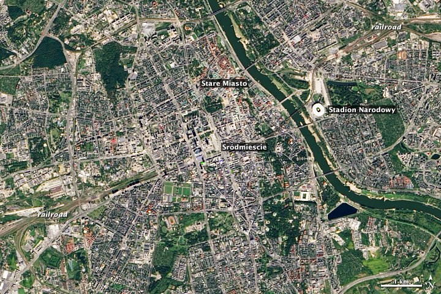
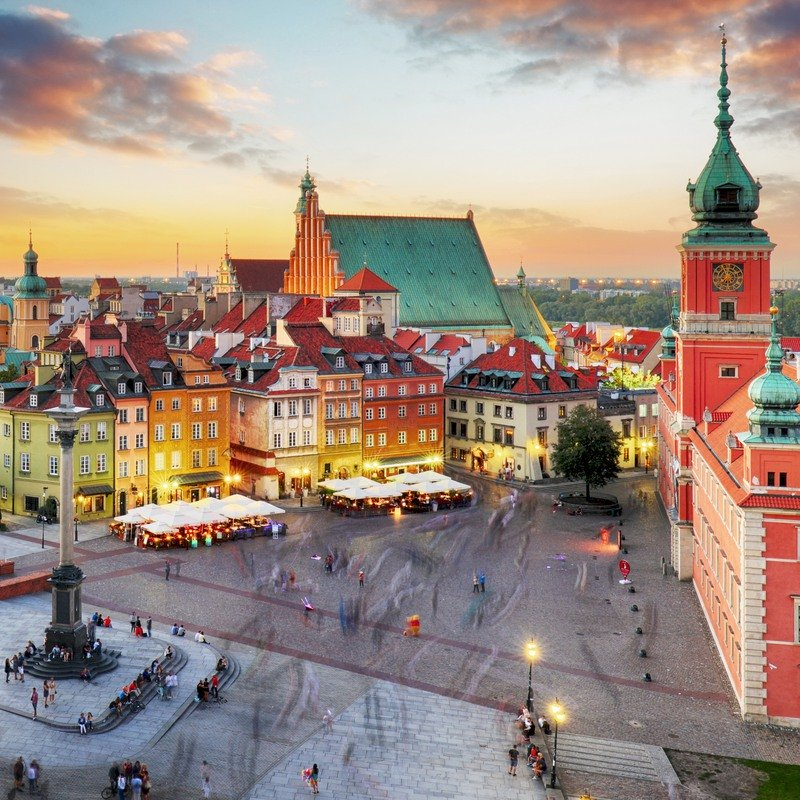
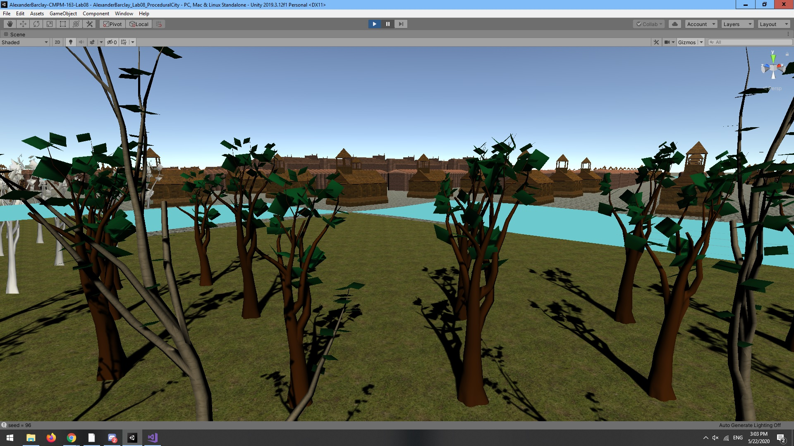
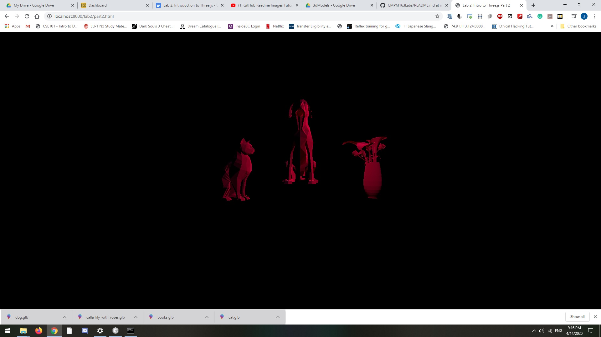

# CMPM163Labs

Lab 8 

a.) I chose part 1

b.) I.) 
  
  
  
  

b.) II.)

  Screenshot: 
  
  

  Video : https://drive.google.com/file/d/1ddEvn8ZmMYYfDrWkoHJPprSqVYGyShl8/view?usp=sharing
  
b.) III.)  The colorful large buildings and frequent churches and cathedrals in Warsaw, Poland inspired me to choose lots of big church buildings and alter their materials to be a little more colorful like the ones in the inspiration images.  The bird's eye view image inspired me to add parks and rivers by procedurally adding water and grass to the city and then added some trees that I generated with unity's tree editor.

d.) My partner was Xueer Zhu, below are my and my partner's responses:

d.) I.)  I followed the tutorial and made some adjustments because the assets I imported came in with inconsistent sizes and orientations. In the if else chain I basically assigned a list of offset floats for translate and rotate and worked them in to the instantiate call.  I adjusted individual footprints in a similar way, and added grass cubes and wave planes for rivers and parks.  The colorful large buildings and frequent churches and cathedrals in Warsaw, Poland inspired me to choose lots of big church buildings and alter their materials to be a little more colorful like the ones in the inspiration images. The bird's eye view image inspired me to add parks and rivers by procedurally adding water and grass to the city and then added some trees that I generated with unity's tree editor.

d.) II.)  I used Perlin noise to generate a 2D texture for building heightmap. A simple function is used to determine building types.      Hand authored design here to tweak the algorithm to make sure certain colored ones are always taller/shorter for more visual distinct clusters. 
Finally, a grid generator is used to spawn such clusters as prefab into the scene to create zones.

e.)  My partner and I did not collaborate on our labs.

Lab 7 Mountain Scene : https://drive.google.com/file/d/1potNOECKmbDDC1aE-v-F972Q1-mAJ-1-/view?usp=sharing

  I chose Part 1 with Unity.

  I started by following the tutorial for the mesh deformation with noise and making a similar shader to modify a plane.  I also added a rocky texture to the plane in the shader graph editor for the mountain plane.  Then I followed the tutorial for the wave shader, modified some of the syntax to work correctly, and added a z axis component to the wave motion by adding the cosine of the z component of the world position of the current vertex plus speed times time in the displacement line of the vertex shader for the wave shader.
  
  I saw that the craggy look of my mountains actually lent itself better to a miniature scale, so I added an ant model and made a material for it and posed some throughout my scene.  I thought it would be funny to use some of the prefabs from the default URP project to make it look like the ants were doing some construction on a rough patch of rubble in a puddle.  One of them is off taking a water break near one of the smaller water holes in my mountain scene.
  
  Partner responses:
  
  1. I did part 1 (Unity)
  2. The most challenging part was the wave shader because the
  tutorial was a bit hard to follow. Then I found
  out that it didn't work properly in HDRP, so I had to switch 
  to URP.
  3. Probably the Unity shader graph. It seems like a useful and 
  relatively easy to use process for creating shaders.

Lab 6

Lab 5 Kart Particle Effect : https://drive.google.com/file/d/1Qlq7ccemRhKeR6Ej660wn9-BlioXh0Ce/view?usp=sharing

  I chose Part 1 with Unity.
  
  For this particle effect I increased weight effect and enabled collision with world surfaces so it would bounce chaotically, and used circular textures with transparency for the trail and emission to make a particle that looks somewhat like a fountain of gold coins.  Then I added a couple of asteroids and changed their proportions so they would resemble a crumpled knapsack. Finally I positioned the knapsack and coin fountain so it would look like our kart rider was racing against a time limit while their gold coins spill out of their bag.

Lab 4 Cubes : https://drive.google.com/file/d/1yzbTllhoQvj21gsjvhFv3zNABbW6eZbe/view?usp=sharing

  For Cube 1 on the left, I used the built in three.js support for textures and chose a mossy texture.
  
  For Cube 2 in the center, I used the same built in three.js support for textures and added a corresponding normal map to the mossy    texture.
  
  For Cube 3 on the right, I used loader code and shader files to add a brick texture with custom lab3 shaders.
  
  For Cube 4 at the top, I used the built in three.js support for textures and normal maps to add a craggy rock texture and normal map.
  
  For Cube5, I used the vertex scripts for lab4 and modified the fragment shader to try and repeat the texture across the cube in a tiling pattern.  Every time I tried to change the vec2 that I would give to texture2D(), what ended up working was to build a new vec2 that would reference the original vUv and modify its x and y components by doubling them and doing a modulus operation on each with a float 1.0.
  
  24)A) My function would be: floor(u * 8)-1
  24)B) My function would be: floor(v * 8)-1
  24)C) The square is white

Lab 3 Cubes : https://drive.google.com/file/d/1vbwVM281gM6FwMchECN343mADcp_CKYn/view?usp=sharing

  For the left three.js material cube I used a pastel purple and transparency, for the right one I used cyan with wireframe.

  For the additional shader cube, I duplicated the aqua interpolating cube and attempted to have it interpolate between black and white   colors, but it came out as a flat red.

Lab2 3 Cubes : https://drive.google.com/file/d/1-oWhbWHQSuGC-jrGVXuo0CKaXrQ-q7Yj/view?usp=sharing

